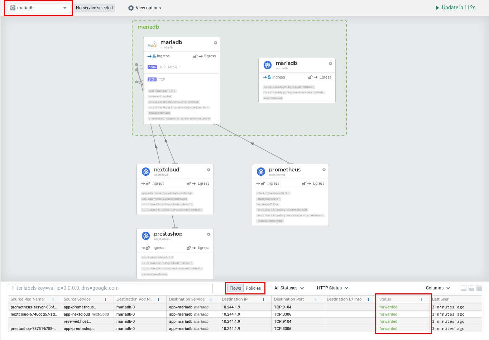
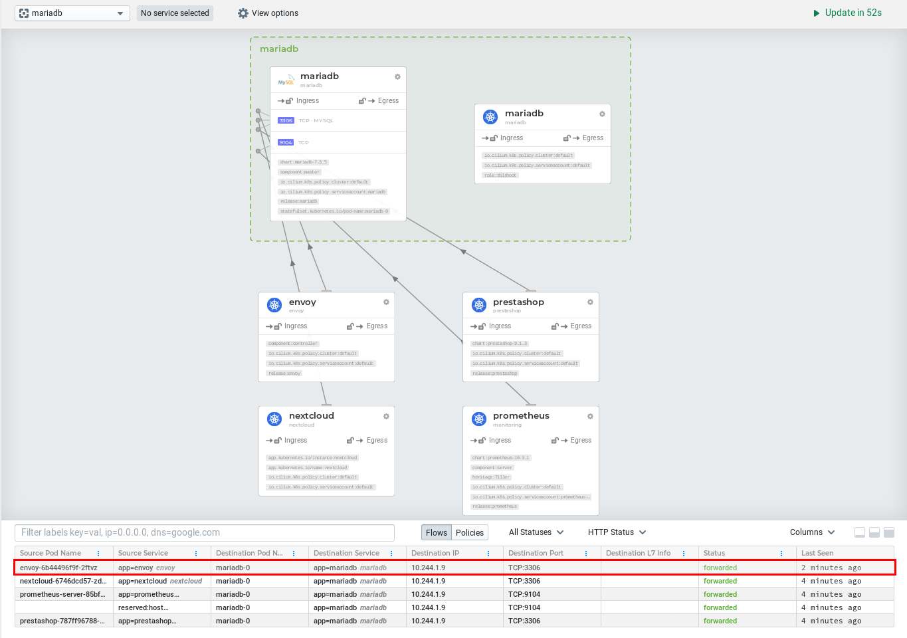

apiVersion: "cilium.io/v2"
kind: CiliumNetworkPolicy
description: "Allow ingress from webapp and metrics"
metadata:
  name: "ingress-webapp-metrics"
  namespace: mariadb
spec:
  endpointSelector:
    matchLabels:
      app: mariadb
  egress:
  - {}
  ingress:
  - fromEndpoints:
    - matchLabels:
        "io.kubernetes.pod.namespace": "nextcloud"
        "app.kubernetes.io/instance": "nextcloud"
    - matchLabels:
        "io.kubernetes.pod.namespace": "prestashop"
        "app": "prestashop"
    - matchLabels:
        "io.kubernetes.pod.namespace": "envoy"
        "app": "envoy"
    - matchLabels:
        "io.kubernetes.pod.namespace": "monitoring"
        "app": "prometheus"
```

And Apply it in the cluster:

```bash
kubectl apply -f mariadb-l3.yaml
```

Remember it is possible to see the network policies:

```bash
kubectl -n mariadb get cnp
```

## Visualize with Hubble

Let's visualize in Hubble if our traffic is still forwarded:

1. In a browser reach `https://hubble.susecon.lab`
2. Select `mariadb` namespace
3. Check the `Status` of the flows in green or red
4. You can also vizualize the policy by clicking on `Policies`



As we can see, every traffic is still forwarded, this probably means that
the policy worked but maybe our policy didn't match the pod so it does not
have any effect ? we'll check that just after :smile:

Hubble only shows when there is traffic, for example here, we
don't see traffic from envoy because we haven't generated any traffic.
Let's do a quick test:

```bash
mysql -u root -h 10.17.3.0 -psusecon -e quit
```

Now we see the traffic originated from envoy:




## Trace with cilium

`cilium policy trace` is extremely powerful when troubleshooting policies.

First, let's test `egress`, normally, we should not be able to reach
any other pod, even the one allowed in ingress.

* Can we reach nextcloud ?

```bash
kubectl -n kube-system exec -ti ds/cilium -- cilium policy trace --src-k8s-pod mariadb:mariadb-0 --dst any:app.kubernetes.io/instance=nextcloud,io.kubernetes.pod.namespace=nextcloud
----------------------------------------------------------------
Tracing From: [k8s:app=mariadb, k8s:chart=mariadb-7.3.5, k8s:component=master, k8s:io.cilium.k8s.policy.cluster=default, k8s:io.cilium.k8s.policy.serviceaccount=mariadb, k8s:io.kubernetes.pod.namespace=mariadb, k8s:release=mariadb, k8s:statefulset.kubernetes.io/pod-name=mariadb-0] => To: [any:app.kubernetes.io/instance=nextcloud, any:io.kubernetes.pod.namespace=nextcloud] Ports: [0/ANY]

Resolving egress policy for [k8s:app=mariadb k8s:chart=mariadb-7.3.5 k8s:component=master k8s:io.cilium.k8s.policy.cluster=default k8s:io.cilium.k8s.policy.serviceaccount=mariadb k8s:io.kubernetes.pod.namespace=mariadb k8s:release=mariadb k8s:statefulset.kubernetes.io/pod-name=mariadb-0]
* Rule {"matchLabels":{"any:app":"mariadb","k8s:io.kubernetes.pod.namespace":"mariadb"}}: selected
1/1 rules selected
Found no allow rule
Egress verdict: denied


Final verdict: DENIED
```

The interestings flags are:

* **--src-k8s-pod mariadb:mariadb-0**: because we use a StatefulSet, the name of the pod
will be always the same so we don't really need to use a label here.
* **--dst any:app.kubernetes.io/instance=nextcloud,io.kubernetes.pod.namespace=nextcloud**: always
the same with our beloved Kubernetes, we select the destination pods using labels.

Here we can see the trace from our mariadb pod to the nextcloud pod in the nextcloud namespace,
that there is a rule in a policy selecting the mariadb pod and that egress is denied.


* Can we be reached from nextcloud ?


```bash
kubectl -n kube-system exec -ti ds/cilium -- cilium policy trace --src any:app.kubernetes.io/instance=nextcloud,io.kubernetes.pod.namespace=nextcloud --dst-k8s-pod mariadb:mariadb-0
----------------------------------------------------------------

Tracing From: [any:app.kubernetes.io/instance=nextcloud, any:io.kubernetes.pod.namespace=nextcloud] => To: [k8s:app=mariadb, k8s:chart=mariadb-7.3.5, k8s:component=master, k8s:io.cilium.k8s.policy.cluster=default, k8s:io.cilium.k8s.policy.serviceaccount=mariadb, k8s:io.kubernetes.pod.namespace=mariadb, k8s:release=mariadb, k8s:statefulset.kubernetes.io/pod-name=mariadb-0] Ports: [0/ANY]

Resolving ingress policy for [k8s:app=mariadb k8s:chart=mariadb-7.3.5 k8s:component=master k8s:io.cilium.k8s.policy.cluster=default k8s:io.cilium.k8s.policy.serviceaccount=mariadb k8s:io.kubernetes.pod.namespace=mariadb k8s:release=mariadb k8s:statefulset.kubernetes.io/pod-name=mariadb-0]
* Rule {"matchLabels":{"any:app":"mariadb","k8s:io.kubernetes.pod.namespace":"mariadb"}}: selected
    Allows from labels {"matchLabels":{"any:app.kubernetes.io/instance":"nextcloud","any:io.kubernetes.pod.namespace":"nextcloud"}}
    Allows from labels {"matchLabels":{"any:app":"prestashop","any:io.kubernetes.pod.namespace":"prestashop"}}
    Allows from labels {"matchLabels":{"any:app":"envoy","any:io.kubernetes.pod.namespace":"envoy"}}
    Allows from labels {"matchLabels":{"any:app":"prometheus","any:io.kubernetes.pod.namespace":"monitoring"}}
      Found all required labels
1/1 rules selected
Found allow rule
Ingress verdict: allowed

Final verdict: ALLOWED
```

* Can we be reached from prometheus ?

```bash
kubectl -n kube-system exec -ti ds/cilium -- cilium policy trace --src any:app=prometheus,io.kubernetes.pod.namespace=nextcloud --dst-k8s-pod mariadb:mariadb-0
----------------------------------------------------------------

Tracing From: [any:app=prometheus, any:io.kubernetes.pod.namespace=nextcloud] => To: [k8s:app=mariadb, k8s:chart=mariadb-7.3.5, k8s:component=master, k8s:io.cilium.k8s.policy.cluster=default, k8s:io.cilium.k8s.policy.serviceaccount=mariadb, k8s:io.kubernetes.pod.namespace=mariadb, k8s:release=mariadb, k8s:statefulset.kubernetes.io/pod-name=mariadb-0] Ports: [0/ANY]

Resolving ingress policy for [k8s:app=mariadb k8s:chart=mariadb-7.3.5 k8s:component=master k8s:io.cilium.k8s.policy.cluster=default k8s:io.cilium.k8s.policy.serviceaccount=mariadb k8s:io.kubernetes.pod.namespace=mariadb k8s:release=mariadb k8s:statefulset.kubernetes.io/pod-name=mariadb-0]
* Rule {"matchLabels":{"any:app":"mariadb","k8s:io.kubernetes.pod.namespace":"mariadb"}}: selected
    Allows from labels {"matchLabels":{"any:app.kubernetes.io/instance":"nextcloud","any:io.kubernetes.pod.namespace":"nextcloud"}}
    Allows from labels {"matchLabels":{"any:app":"prestashop","any:io.kubernetes.pod.namespace":"prestashop"}}
    Allows from labels {"matchLabels":{"any:app":"envoy","any:io.kubernetes.pod.namespace":"envoy"}}
    Allows from labels {"matchLabels":{"any:app":"prometheus","any:io.kubernetes.pod.namespace":"monitoring"}}
      No label match for [any:app=prometheus any:io.kubernetes.pod.namespace=nextcloud]
1/1 rules selected
Found no allow rule
Ingress verdict: denied

Final verdict: DENIED
```

It looks like it's working :smile: our rules are applied to the pod.
We'll see with our upgraded policy how we can be more specific when
tracing a policy.


## Test it in CLI


Apply Network Policies
======================


Congrats !!
